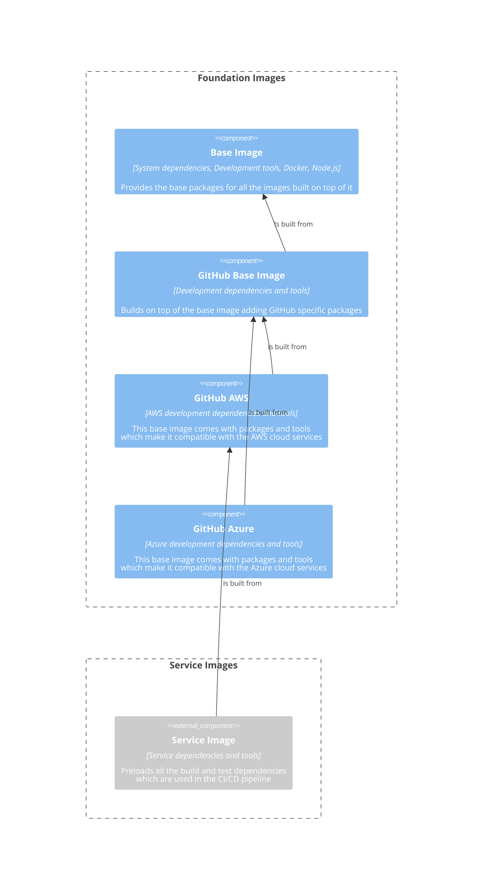

# GitHub Runner Image (PoC / Experimental)

[](https://github.com/nhs-england-tools/github-runner-image/actions/workflows/cicd-2-publish.yaml)
[](https://sonarcloud.io/summary/new_code?id=github-runner-image)

TODO: Overview

## Table of Contents

- [GitHub Runner Image (PoC / Experimental)](#github-runner-image-poc--experimental)
  - [Table of Contents](#table-of-contents)
  - [Setup](#setup)
    - [Prerequisites](#prerequisites)
    - [Installation](#installation)
  - [Usage](#usage)
    - [Testing](#testing)
  - [Architecture](#architecture)
    - [Diagrams](#diagrams)
    - [Configuration](#configuration)
  - [Contributing](#contributing)
  - [Contacts](#contacts)
  - [Licence](#licence)

## Setup

By including preferably a one-liner or if necessary a set of clear CLI instructions we improve user experience. This should be a frictionless installation process that works on various operating systems (macOS, Linux, Windows WSL) and handles all the dependencies.

Clone the repository

```shell
git clone https://github.com/nhs-england-tools/github-runner-image.git
cd nhs-england-tools/github-runner-image
```

### Prerequisites

The following software packages or their equivalents are expected to be installed

- [GNU make](https://www.gnu.org/software/make/) **v3.82 or later: OS X users, take note below**
- [Docker](https://www.docker.com/)

Note that the version of GNU Make available by default on OS X is earlier than this.  You will need to upgrade it, or certain `make` tasks will fail. On OS X, you will need [homebrew](https://brew.sh/) installed, then to install `make`, like so:

```shell
/bin/bash -c "$(curl -fsSL https://raw.githubusercontent.com/Homebrew/install/HEAD/install.sh)"
brew install make
```

You will then see instructions to fix your `$PATH` variable to make the newly installed version available.
If you are using [dotfiles](https://github.com/nhs-england-tools/dotfiles), this is all done for you.

### Installation

Install and configure toolchain dependencies

```shell
make config
```

If this repository is

```shell
/bin/bash -c "$(curl -fsSL https://raw.githubusercontent.com/org/repo/branch/install.sh)"
```

## Usage

After a successful installation, provide an informative example of how this project can be used. Additional code snippets, screenshots and demos work well in this space. You may also link to the other documentation resources, e.g. the [User Guide](./docs/user-guide.md) to demonstrate more use cases and to show more features.

### Testing

There are `make` tasks for you to configure to run your tests. Run `make test` to see how they work.  You should be able to use the same entry points for local development as in your CI pipeline.

## Architecture

### Diagrams



### Configuration

Most of the projects are built with customisability and extendability in mind. At a minimum, this can be achieved by implementing service level configuration options and settings. The intention of this section is to show how this can be used. If the system processes data, you could mention here for example how the input is prepared for testing - anonymised, synthetic or live data.

## Contributing

Describe or link templates on how to raise an issue, feature request or make a contribution to the codebase. Reference the other documentation files, like

- Environment setup for contribution, i.e. `CONTRIBUTING.md`
- Coding standards, branching, linting, practices for development and testing
- Release process, versioning, changelog
- Backlog, board, roadmap, ways of working
- High-level requirements, guiding principles, decision records, etc.

## Contacts

Provide a way to contact the owners of this project. It can be a team, an individual or information on the means of getting in touch via active communication channels, e.g. opening a GitHub discussion, raising an issue, etc.

## Licence

> The [LICENCE.md](./LICENCE.md) file will need to be updated with the correct year and owner

Unless stated otherwise, the codebase is released under the MIT License. This covers both the codebase and any sample code in the documentation.

Any HTML or Markdown documentation is [© Crown Copyright](https://www.nationalarchives.gov.uk/information-management/re-using-public-sector-information/uk-government-licensing-framework/crown-copyright/) and available under the terms of the [Open Government Licence v3.0](https://www.nationalarchives.gov.uk/doc/open-government-licence/version/3/).
